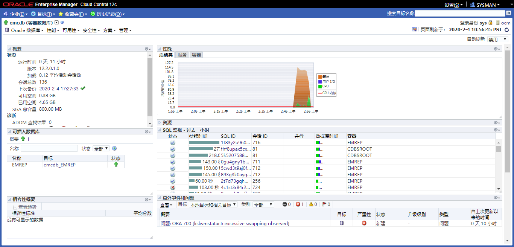
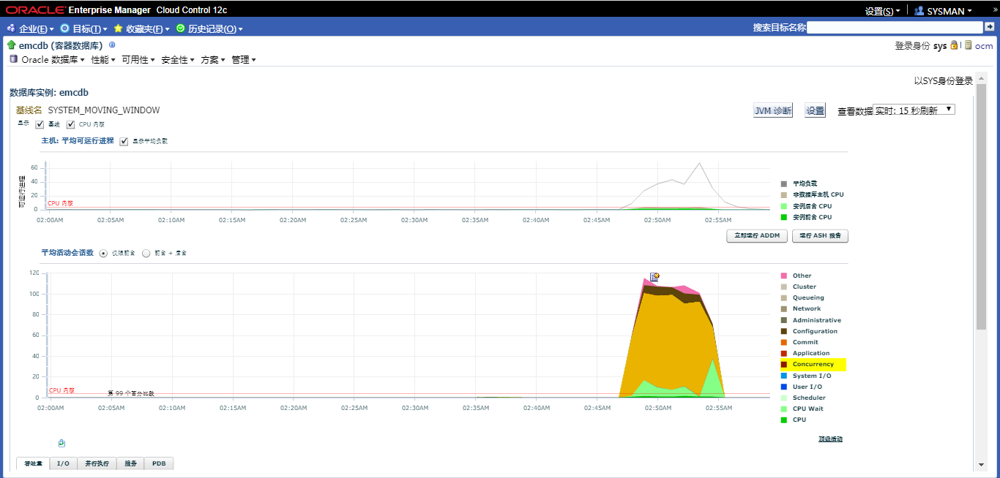
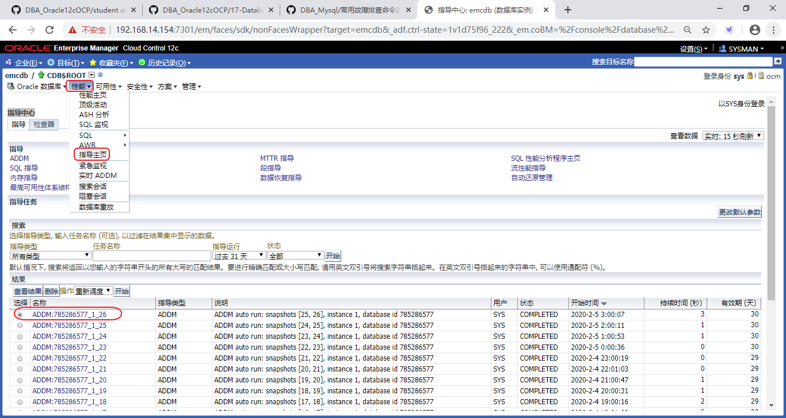
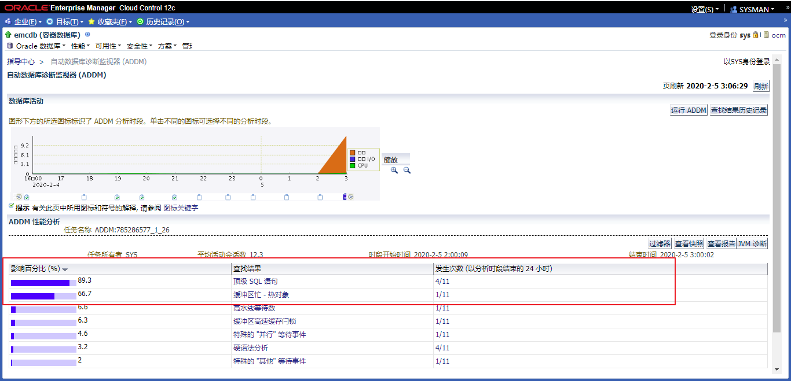
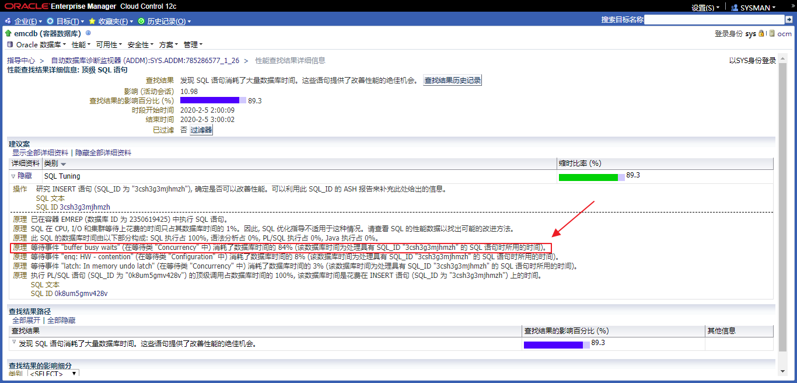
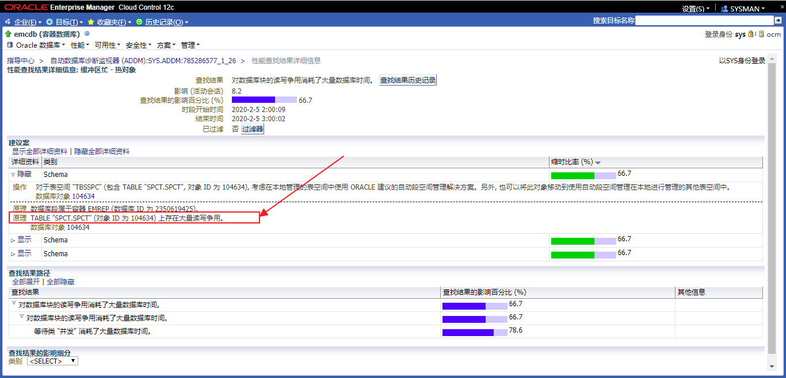
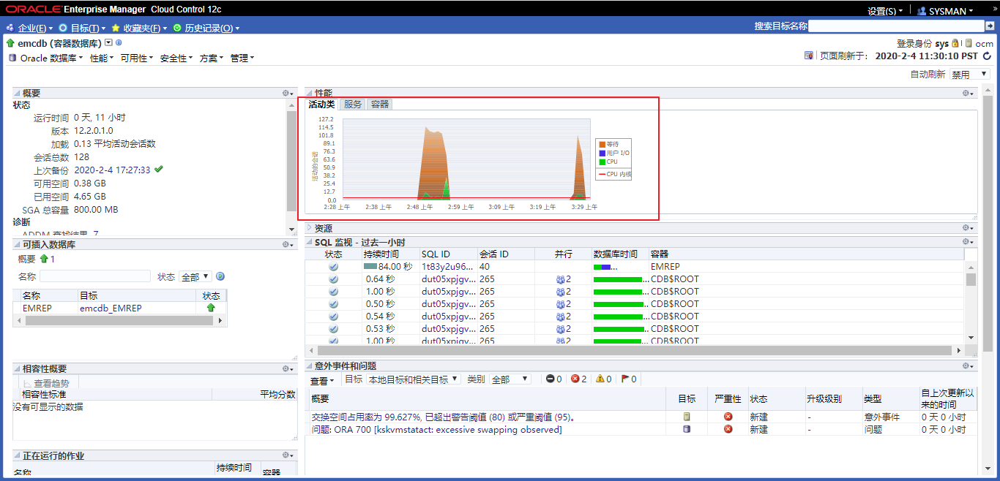
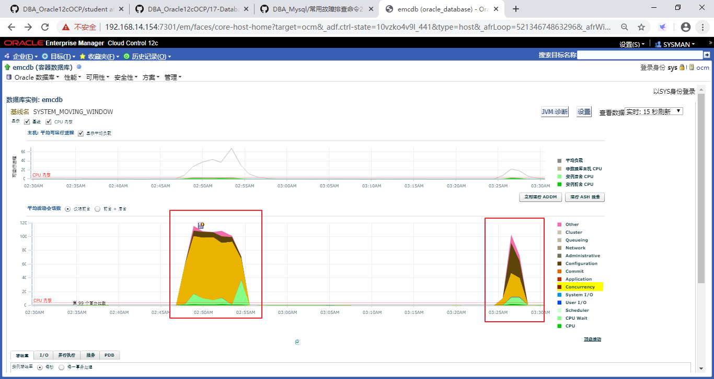
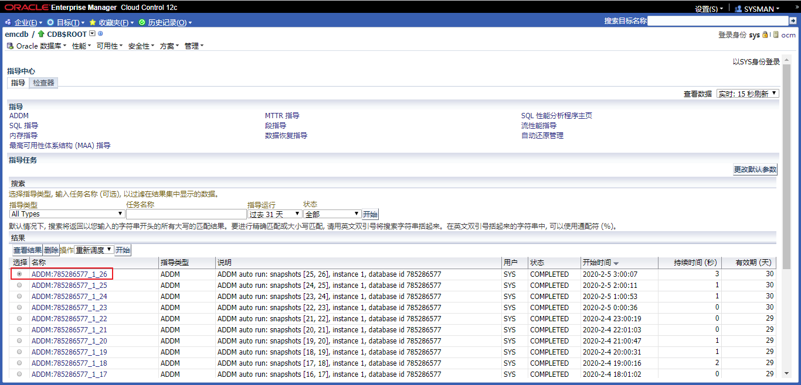

# 实践17:数据库维护

> **Practices for Lesson 17: Database Maintenance**
>
> 2020.01.29 BoobooWei

<!-- MDTOC maxdepth:2 firsth1:1 numbering:0 flatten:0 bullets:1 updateOnSave:1 -->

- [实践17:数据库维护](#实践17数据库维护)   
   - [实践17:概览](#实践17概览)   
   - [实践17-1:数据库维护](#实践17-1数据库维护)   
   - [实践17-2:修改PDB数据库名称](#实践17-2修改pdb数据库名称)   
   - [实践17-3:修改CDB的数据库名称](#实践17-3修改cdb的数据库名称)   
   - [实践17-4:在PDB上使用STARTUP SQL * Plus命令Management](#实践17-4在pdb上使用startup-sql-plus命令management)   
   - [实践17-5:删除PDB](#实践17-5删除pdb)   
   - [实践17-6:创建PDB](#实践17-6创建pdb)   
   - [实践17-7:拔出PDB](#实践17-7拔出pdb)   
   - [实践17-8:Non-CDB to PDB](#实践17-8non-cdb-to-pdb)   
   - [总结](#总结)   

<!-- /MDTOC -->

## 实践17:概览

Practices for Lesson 17: Overview

**Background:** You want to proactively monitor your orcl database so that common problems can be fixed before they affect users. Users, developers, and unanticipated changes in the way applications are used can bring serious performance problems. As DBA you are seldom informed about what changed, you are instead told there is a generic problem. At that point you must find the problem based often on misleading information from users.

In this scenario, a developer is providing scripts for you to run to provision changes to an application. These supplied scripts create a problem so that you can familiarize yourself with the tools that are available. Examine each script to satisfy yourself that the script is doing what you have been told.

These practices have been scripted because delays in performing the tasks can have a large effect on the results you see due to the short time that the workload runs.

背景:您希望主动监控数据库，以便在常见问题影响用户之前修复它们。用户、开发人员和应用程序使用方式的意外变化可能带来严重的性能问题。作为DBA，您很少被告知发生了什么变化，而是被告知存在一个通用问题。此时，您必须根据来自用户的误导信息发现问题。
在此场景中，开发人员为您提供脚本，以运行对应用程序的供应更改。这些提供的脚本会产生一个问题，以便您能够熟悉可用的工具。检查每个脚本，以确保脚本正在执行所告知的操作。
这些实践已经编写了脚本，因为由于工作负载运行的时间很短，执行任务的延迟会对您看到的结果产生很大的影响。

## 实践17-1:数据库维护

Practice 17-1: Database Maintenance

### Overview

### Task

1. A new tablespace is being added to hold the new tables. The first script creates a new locally managed tablespace called TBSSPC with a data file named`/u01/app/oracle/oradata/orcl/tbsspc01.dbf `of 50 MB. Ensure that the TBSSPC tablespace does not use Automatic Segment Space Management (ASSM). The **lab_17_01_01.sh** script performs these tasks. Examine the script and then execute it.

2. The `lab_17_01_02.sh` script adds a new user. The script creates the `SPCT` user, identified by `oracle_4U`, assigns the TBSSPC tablespace as the default tablespace, assigns the TEMP tablespace as the temporary tablespace, and grants the CONNECT, RESOURCE, and DBA roles to the SPCT user. Execute the **lab_17_01_02.sh** script to perform these tasks.

3. The test workload that is provided runs only a few minutes. In order to get meaningful data, the time between Automatic Workload Repository (AWR) snapshots should be reduced. Use the `DBMS_ADVISOR` package to set the database activity time to 30 minutes. The test script, running as the SPCT user, drops and creates the SPCT table and gathers statistics for this table. It also creates a snapshot in AWR. Execute the **lab_17_01_03.sh** script to perform these tasks.

4. Run the workload script. This creates an activity to be analyzed. Execute the **lab_17_01_04.sh** script to perform these tasks. DO NOT wait for the script to finish continue to the next step.

5. Watch the activity in the Active Session Graph on the Cloud Control Performance Home page until the script completes.

   | **Step** | **Window/Page Description** | **Choices or Values**                                        |
   | -------- | --------------------------- | ------------------------------------------------------------ |
   | a.       | Cloud Control               | Login  User: **ADMIN**  Password: **oracle_4U**              |
   | b.       | Summary                     | Navigate to the **orcl** database home page.                 |
   | c.       | orcl database home          | Click **Performance** > **Performance Home.**                |
   | d.       | Database Login              | Credentials: Select **Preferred.**  Preferred Credential Name: **SYSDBA Database Credentials**  Click **Login.** |
   | e.       | Database Instance: orcl     | Verify that the refresh rate is set to Real  Time:  15 Second Refresh  Watch the **Average Active Session** graph until It has peaked and returned to the previous low level. |

6. After the spike has finished, return to the terminal window to execute the

   lab_17_01_05.sh script.

7.  Find and examine the ADDM Performance Analysis and findings.

| **Step** | **Window/Page Description**                   | **Choices or Values**                                        |
| -------- | --------------------------------------------- | ------------------------------------------------------------ |
| a.       | Database Instance: orcl                       | Click **Performance >  Advisors Home**                       |
| b.       | Advisors Central                              | In the result  section, click the latest ADDM  report.       |
| c.       | Automatic Database Diagnostic  Monitor (ADDM) | Notice the findings. Click each finding.  Review the Detail  findings. |

   d.  Look at the **Performance Analysis** findings in order of their impact. There are several access paths to this information.

   e.  Looking at the Performance Analysis section, you see that the first finding has a high percentage (in this example, 98.9 percent) impact on the system. So your first step is to look at this finding in more detail. Click the link in the Finding column. In the Recommendations Rationale, you find a statement “waiting for event ‘Buffer Busy Waits’”.

   f.   Return to the ADDM Performance Analysis page and investigate the other ADDM findings in order of severity. Look at the **Buffer Busy** findings in particular by clicking the link in the Finding column. For one of the Buffer Busy results, you should see that there is read-and-write contention on your SPCT table. The recommended action is to use the Automatic Segment Space Management (ASSM) feature for your SPCT table. The Rationale shows that there is a hot data block that belongs to the SPCT.SPCT table.

   The findings may appear in a different order than shown. If you do not see results similar to the ones outlined in the preceding screenshot, you may need to restart this practice. If you still do not see the expected results, you may need to adjust the load by modifying the lab_17_01_04.sh and lab_17_01_04.sql scripts. Ask your instructor for assistance if this is the case. Take care not to increase the load too much or you will slow your system down too much.

8. decide to implement the recommendation to use Automated Segment Space Management. To do this, you must re-create the object. Create a new, locally managed tablespace, called TBSSPC2 with a 50 MB data file. Ensure that the TBSSPC2 tablespace uses the Automatic Segment Space Management feature. Then execute the **lab_17_01_07.sh** script to drop the SPCT table, re-create the table in the new tablespace, gather statistics, and to take a new snapshot.

   | **Step** | **Window/Page**  **Description** | **Choices or Values**                                        |
   | -------- | -------------------------------- | ------------------------------------------------------------ |
   | a.       | Cloud Control                    | Click **Administration > Storage >  Tablespaces**            |
   | b.       | Tablespaces                      | Click **Create.**                                            |
   | c.       | Create Tablespace                | Enter  Name: **TBSSPC2**  In the Datafiles section, click  **Add.** |
   | d.       | Add Datafile                     | Enter  File Name: **tbsspc02.dbf**  File Size: **50  MB**  Verify Automatically extend data  file when full  is NOT  checked  Click **Continue.** |
   | e.       | Create Tablespace                | Click the **Storage** tab.                                   |
   | f.       | Create Tablespace: Storage tab   | Verify  Extent Allocation: **Automatic**                     |
   |          |                                  | Segment Space Management: **Automatic**  Click **Show SQL**. |
   | g.       | Show SQL                         | Examine the  SQL Statement.  It should be:  CREATE SMALLFILE TABLESPACE "TBSSPC2"  DATAFILE  '/u01/app/oracle/oradata/orcl/tbsspc02.dbf'  SIZE 50M LOGGING EXTENT  MANAGEMENT LOCAL SEGMENT SPACE  MANAGEMENT AUTO  Click **Return**. |
   | h.       | Create Tablespace: Storage tab   | Click **OK**.                                                |
   | i.       | Tablespaces                      |                                                              |

9. Execute your workload again. (Use the **lab_17_01_04.sh** script.) DO NOT wait for the script to complete continue to next task.

10.  Return to Enterprise Manager Cloud Control. On the orcl Performance Home page, review the Average Active Session graph. View performance data in real time with a 15- second refresh cycle. After a while, you should see a spike on the Average Active Sessions graph. **Hint:** This is that same procedure that you used in Task 5.

   After the spike is finished, execute the **lab_17_01_05.sh** script again. This script forces the creation of a new snapshot and gathers statistics on the table in the workload test.

   a.  Invoke Enterprise Manager as the **D****BA1** user in the **SYSDBA** role for your **orcl**

   database.

   b.  Select **Performance Home** in the **Performance** menu. Watch for the spike in the Active Sessions chart to complete.

   c.  After the spike is finished, run the **lab_17_01_05.sh** script to force the creation of a new snapshot and gather statistics on your SPCT table.

   **Note:** You may have to press Enter after the PL/SQL procedures from step 9 have completed in order to see the command prompt again.

11. Review the ADDM from the **Advisor Home** link.

    | **Step** | **Window/Page Description**                   | **Choices or Values**                          |
    | -------- | --------------------------------------------- | ---------------------------------------------- |
    | a.       | Cloud Control                                 | Click **Performance >  Advisors Home.**        |
    | b.       | Advisor Central                               | Click the latest ADDM  report.                 |
    | c.       | Automatic Database Diagnostic  Monitor (ADDM) | Review the ADDM Performance  Analysis section. |

    You see that the impact value for the Buffer Busy finding (indicating read-and-write contention) has been greatly reduced or is no longer there. By moving the ADDM table to the locally managed TBSSPC2 tablespace, which uses the Automatic Autoextend Segment feature, you obviously fixed the root cause of the contention problem.

    **Note:** You may see additional Buffer Busy findings (at a lower impact percentage) and other further recommendations that could improve performance, but you are not going to pursue them at this time.

12. Execute the **lab_17_01_11.sh** script to clean up your environment so that this practice will not affect other practices.

### Practice

1. 添加了一个新的表空间来容纳新表。第一个脚本使用一个名为/u01/app/oracle/oradata/orcl/tbsspc01的数据文件创建一个名为TBSSPC的新本地管理表空间。确保TBSSPC表空间不使用自动段空间管理(ASSM)。lab_17_01_01.sh脚本执行这些任务。检查脚本，然后执行它。

   ```bash
   [oracle@ocm P17]$ pwd
   /u01/software/labs/P17
   [oracle@ocm P17]$ ll
   total 32
   -rw-r--r-- 1 oracle oinstall 603 Jan 22  2013 lab_17_01_01.sh
   -rw-r--r-- 1 oracle oinstall 521 Jan 22  2013 lab_17_01_02.sh
   -rw-r--r-- 1 oracle oinstall 694 Jan 22  2013 lab_17_01_03.sh
   -rw-r--r-- 1 oracle oinstall 483 Jan 23  2013 lab_17_01_04.sh
   -rw-r--r-- 1 oracle oinstall 345 Jan 22  2013 lab_17_01_04.sql
   -rw-r--r-- 1 oracle oinstall 522 Jan 22  2013 lab_17_01_05.sh
   -rw-r--r-- 1 oracle oinstall 616 Jan 22  2013 lab_17_01_07.sh
   -rw-r--r-- 1 oracle oinstall 476 Jan 22  2013 lab_17_01_11.sh

   [oracle@ocm P17]$ cat P17/lab_17_01_01.sh
   cd $LABS/P17

   . $LABS/set_db.sh
   sqlplus dba1/oracle@emrep as sysdba << END

   set echo on

   drop tablespace TBSSPC including contents and datafiles;

   CREATE SMALLFILE TABLESPACE "TBSSPC"
   DATAFILE '/u01/app/oracle/oradata/booboo/tbsspc01.dbf' SIZE 50M
   AUTOEXTEND ON NEXT 10M MAXSIZE 200M
   LOGGING
   EXTENT MANAGEMENT LOCAL
   SEGMENT SPACE MANAGEMENT MANUAL;

   exit;
   END

   [oracle@ocm labs]$ export LABS=/u01/software/labs
   [oracle@ocm labs]$ bash P17/lab_17_01_01.sh
   The Oracle base remains unchanged with value /u01/app/oracle

   SQL*Plus: Release 12.2.0.1.0 Production on Wed Feb 5 02:36:50 2020

   Copyright (c) 1982, 2016, Oracle.  All rights reserved.

   Last Successful login time: Wed Feb 05 2020 02:34:23 +08:00

   Connected to:
   Oracle Database 12c Enterprise Edition Release 12.2.0.1.0 - 64bit Production

   SQL> SQL> SQL> drop tablespace TBSSPC including contents and datafiles
   *
   ERROR at line 1:
   ORA-00959: tablespace 'TBSSPC' does not exist
   ```


   SQL> SQL>   2    3    4    5    6  
   Tablespace created.

   SQL> SQL> Disconnected from Oracle Database 12c Enterprise Edition Release 12.2.0.1.0 - 64bit Production
   ```


2. lab_17_01_02.sh脚本添加了一个新用户。该脚本创建由oracle_4U标识的SPCT用户，将TBSSPC表空间指定为默认表空间，将临时表空间指定为临时表空间，并将连接、资源和DBA角色授予SPCT用户。执行lab_17_01_02.sh脚本来执行这些任务。

   ```bash
   [oracle@ocm labs]$ cd $LABS/P17

   . $LABS/set_db.sh

   sqlplus dba1/oracle@emrep as sysdba << END

   set echo on

   drop user spct cascade;

   create user spct identified by oracle_4U account unlock
   default tablespace TBSSPC
   temporary tablespace temp;

   grant connect, resource, dba to spct;

   exit;
   END

   [oracle@ocm labs]$ bash P17/lab_17_01_02.sh
   The Oracle base remains unchanged with value /u01/app/oracle

   SQL*Plus: Release 12.2.0.1.0 Production on Wed Feb 5 02:37:22 2020

   Copyright (c) 1982, 2016, Oracle.  All rights reserved.

   Last Successful login time: Wed Feb 05 2020 02:36:50 +08:00

   Connected to:
   Oracle Database 12c Enterprise Edition Release 12.2.0.1.0 - 64bit Production

   SQL> SQL> SQL> SQL> drop user spct cascade
             *
   ERROR at line 1:
   ORA-01918: user 'SPCT' does not exist


   SQL> SQL>   2    3  
   User created.

   SQL> SQL>
   Grant succeeded.

   SQL> SQL> Disconnected from Oracle Database 12c Enterprise Edition Release 12.2.0.1.0 - 64bit Production
   ```


3. 提供的测试工作负载只运行几分钟。为了获得有意义的数据，应该缩短自动工作负载存储库(AWR)快照之间的时间。使用DBMS_ADVISOR包将数据库活动时间设置为30分钟。作为SPCT用户运行的测试脚本删除并创建SPCT表，并收集此表的统计信息。它还在AWR中创建快照。执行lab_17_01_03.sh脚本来执行这些任务。

   ```SQL
   [oracle@ocm P17]$ cat lab_17_01_03.sh
   # Oracle Database 12c: Administration Workshop
   # Oracle Server Technologies - Curriculum Development
   #
   # ***Training purposes only***
   # ***Not appropriate for production use***
   #
   # Start this script as OS user: oracle
   #   This script supports the ADDM practice

   cd $LABS/P17

   . $LABS/set_db.sh

   sqlplus dba1/oracle@emrep as sysdba  << EOF

   set echo on

   exec dbms_advisor.set_default_task_parameter('ADDM','DB_ACTIVITY_MIN',30);

   connect spct/oracle_4U@emrep

   drop table spct purge;
   create table spct(id number, name varchar2(2000));

   exec DBMS_STATS.GATHER_TABLE_STATS(-
   ownname=>'SPCT', tabname=>'SPCT',-
   estimate_percent=>DBMS_STATS.AUTO_SAMPLE_SIZE);

   exec DBMS_WORKLOAD_REPOSITORY.CREATE_SNAPSHOT();

   exit;
   EOF
   ```


   [oracle@ocm labs]$ bash P17/lab_17_01_03.sh
   The Oracle base remains unchanged with value /u01/app/oracle

   SQL*Plus: Release 12.2.0.1.0 Production on Wed Feb 5 02:43:47 2020

   Copyright (c) 1982, 2016, Oracle.  All rights reserved.

   Last Successful login time: Wed Feb 05 2020 02:41:32 +08:00

   Connected to:
   Oracle Database 12c Enterprise Edition Release 12.2.0.1.0 - 64bit Production

   SQL> SQL> SQL> SQL>
   PL/SQL procedure successfully completed.

   SQL> SQL> Connected.
   SQL> SQL> drop table spct purge
              *
   ERROR at line 1:
   ORA-00942: table or view does not exist


   SQL>
   Table created.

   SQL> SQL> > >
   PL/SQL procedure successfully completed.

   SQL> SQL>
   PL/SQL procedure successfully completed.

   SQL> SQL> Disconnected from Oracle Database 12c Enterprise Edition Release 12.2.0.1.0 - 64bit Production
   ```


4. 运行工作负载脚本。这将创建要分析的活动。执行lab_17_01_04.sh脚本来执行这些任务。不要等待脚本完成，继续下一步。

   ```bash
   [oracle@ocm P17]$ cat lab_17_01_04.sh
   # Oracle Database 12c: Administration Workshop
   # Oracle Server Technologies - Curriculum Development
   #
   # ***Training purposes only***
   # ***Not appropriate for production use***
   #
   # Start this script as OS user: oracle
   #   This script supports the ADDM practice

   #!/bin/bash

   cd $LABS/P17

   . $LABS/set_db.sh

   . $LABS/wkfctrfunc

   users=12
   cpufactor $users

   x=1
   y=$newval
   UNPW="spct/oracle_4U@emrep"

   while [ $x -le $y ]
   do
       sqlplus -s $UNPW @lab_17_01_04.sql &
       x=`expr $x + 1`
   done
   [oracle@ocm P17]$ cat lab_17_01_04.sql
   -- Oracle Database 12c: Administration Workshop
   -- Oracle Server Technologies - Curriculum Development
   --
   -- ***Training purposes only***
   -- ***Not appropriate for production use***
   --
   --   This script supports the ADDM practice


   declare
   t number;
   begin
   for t in 1..20000 loop
   insert into spct values (Null,'a');
   commit;
   end loop;
   end;
   /
   exit

   [oracle@ocm labs]$ bash P17/lab_17_01_04.sh
   The Oracle base remains unchanged with value /u01/app/oracle
   ```


5. 在云控制性能主页上查看活动会话图中的活动，直到脚本完成。

   

   

6. 当spike完成后，返回到终端窗口执行lab_17_01_05.sh脚本。

   ```bash
   [oracle@ocm P17]$ cat lab_17_01_05.sh
   # Oracle Database 12c: Administration Workshop
   # Oracle Server Technologies - Curriculum Development
   #
   # ***Training purposes only***
   # ***Not appropriate for production use***
   #
   # Start this script as OS user: oracle
   #   This script supports the ADDM practice

   cd $LABS/P17

   . $LABS/set_db.sh

   sqlplus spct/oracle_4U@emrep  << END

   set echo on

   exec DBMS_WORKLOAD_REPOSITORY.CREATE_SNAPSHOT();

   exec DBMS_STATS.GATHER_TABLE_STATS(-
   ownname=>'SPCT', tabname=>'SPCT',-
   estimate_percent=>DBMS_STATS.AUTO_SAMPLE_SIZE);

   exit;
   END

   [oracle@ocm labs]$ bash P17/lab_17_01_05.sh
   The Oracle base remains unchanged with value /u01/app/oracle

   SQL*Plus: Release 12.2.0.1.0 Production on Wed Feb 5 03:01:18 2020

   Copyright (c) 1982, 2016, Oracle.  All rights reserved.

   Last Successful login time: Wed Feb 05 2020 02:47:19 +08:00

   Connected to:
   Oracle Database 12c Enterprise Edition Release 12.2.0.1.0 - 64bit Production

   SQL> SQL> SQL> SQL>
   PL/SQL procedure successfully completed.

   SQL> SQL> > >
   PL/SQL procedure successfully completed.

   SQL> SQL> Disconnected from Oracle Database 12c Enterprise Edition Release 12.2.0.1.0 - 64bit Production
   ```


7. 查找和检查ADDM性能分析和结果。

   

   

   

   返回ADDM性能分析页面并研究其他ADDM按严重程度排序。

   通过单击查看缓冲区繁忙的结果查找列中的链接。

   对于一个繁忙的缓冲区结果，您应该看到这一点在SPCT表上存在读写争用。建议的操作是

   使用SPCT表的自动段空间管理(ASSM)功能。

   

8. 决定实施建议使用自动段空间管理。为此，必须重新创建对象。创建一个新的本地管理的表空间，名为TBSSPC2，其数据文件大小为50 MB。确保TBSSPC2表空间使用自动段空间管理特性。然后执行lab_17_01_07.sh脚本删除SPCT表，在新的表空间中重新创建表，收集统计信息，并获取新的快照。

   ``` bash
   [oracle@ocm P17]$ cat lab_17_01_07.sh
   # Oracle Database 12c: Administration Workshop
   # Oracle Server Technologies - Curriculum Development
   #
   # ***Training purposes only***
   # ***Not appropriate for production use***
   #
   # Start this script as OS user: oracle
   #   This script supports the ADDM practice

   cd $LABS/P17

   . $LABS/set_db.sh

   sqlplus spct/oracle_4U@emrep << END

   set echo on

   drop table spct purge;

   create table SPCT(id number, name varchar2(2000)) tablespace TBSSPC2;

   exec DBMS_STATS.GATHER_TABLE_STATS(-
   ownname=>'SPCT', tabname=>'SPCT',-
   estimate_percent=>DBMS_STATS.AUTO_SAMPLE_SIZE);

   exec DBMS_WORKLOAD_REPOSITORY.CREATE_SNAPSHOT();

   exit;
   END
   ```


   sqlplus dba1/oracle@emrep as sysdba  << EOF
   CREATE SMALLFILE TABLESPACE "TBSSPC2"
   DATAFILE '/u01/app/oracle/oradata/booboo/booboopdb1/tbsspc02.dbf'
   SIZE 50M LOGGING EXTENT MANAGEMENT LOCAL
   SEGMENT SPACE MANAGEMENT AUTO;
   EOF

   [oracle@ocm labs]$ bash P17/lab_17_01_07.sh
   The Oracle base remains unchanged with value /u01/app/oracle

   SQL*Plus: Release 12.2.0.1.0 Production on Wed Feb 5 03:23:37 2020

   Copyright (c) 1982, 2016, Oracle.  All rights reserved.

   Last Successful login time: Wed Feb 05 2020 03:01:18 +08:00

   Connected to:
   Oracle Database 12c Enterprise Edition Release 12.2.0.1.0 - 64bit Production

   SQL> SQL> SQL> SQL>
   Table dropped.

   SQL> SQL>
   Table created.

   SQL> SQL> > >
   PL/SQL procedure successfully completed.

   SQL> SQL>
   PL/SQL procedure successfully completed.

   SQL> SQL> Disconnected from Oracle Database 12c Enterprise Edition Release 12.2.0.1.0 - 64bit Production
   ```


9. 再次执行工作负载。(使用lab_17_01_04.sh脚本。)不要等待脚本完成，继续下一个任务。

   ```bash
   [oracle@ocm labs]$ bash P17/lab_17_01_04.sh
   The Oracle base remains unchanged with value /u01/app/oracle
   ```


10. 回到企业经理云控制。在性能主页上，查看平均活动会话图。以15秒的刷新周期实时查看性能数据。一段时间后，您应该会在平均活动会话图上看到一个峰值。提示:这与您在Task 5中使用的过程相同。

    当spike完成后，返回到终端窗口执行lab_17_01_05.sh脚本。

    ```bash
    PL/SQL procedure successfully completed.
    ```


    [oracle@ocm labs]$ bash P17/lab_17_01_05.sh
    The Oracle base remains unchanged with value /u01/app/oracle

    SQL*Plus: Release 12.2.0.1.0 Production on Wed Feb 5 03:28:56 2020

    Copyright (c) 1982, 2016, Oracle.  All rights reserved.

    Last Successful login time: Wed Feb 05 2020 03:25:50 +08:00

    Connected to:
    Oracle Database 12c Enterprise Edition Release 12.2.0.1.0 - 64bit Production

    SQL> SQL> SQL> SQL>
    PL/SQL procedure successfully completed.

    SQL> SQL> > >
    PL/SQL procedure successfully completed.

    SQL> SQL> Disconnected from Oracle Database 12c Enterprise Edition Release 12.2.0.1.0 - 64bit Production
    ```

    


11. 从Advisor主页链接查看ADDM。

    您可以看到Busy查找缓冲区的影响值(表示读写)争用)已大大减少或不再存在。将ADDM表移动到

    本地管理的TBSSPC2表空间，它使用自动自动扩展段显然，您已经修复了争用问题的根源。

    注意:您可能会看到额外的缓冲区繁忙的结果(在较低的影响百分比)和其他可以提高性能的建议。
    

    

12. 执行lab_17_01_11.sh脚本来清理您的环境，这样就不会影响其他实践。

    ```bash
    [oracle@ocm P17]$ cat lab_17_01_11.sh
    # Oracle Database 12c: Administration Workshop
    # Oracle Server Technologies - Curriculum Development
    #
    # ***Training purposes only***
    # ***Not appropriate for production use***
    #
    # Start this script as OS user: oracle
    #   This script supports the ADDM practice

    cd $LABS/P17

    . $LABS/set_db.sh

    sqlplus dba1/oracle@emrep as sysdba  << END
    drop user spct cascade;

    drop tablespace tbsspc including contents and datafiles;

    drop tablespace tbsspc2 including contents and datafiles;

    exit;
    END

    [oracle@ocm labs]$ bash P17/lab_17_01_11.sh
    The Oracle base remains unchanged with value /u01/app/oracle

    SQL*Plus: Release 12.2.0.1.0 Production on Wed Feb 5 03:42:41 2020

    Copyright (c) 1982, 2016, Oracle.  All rights reserved.

    Last Successful login time: Wed Feb 05 2020 02:43:47 +08:00

    Connected to:
    Oracle Database 12c Enterprise Edition Release 12.2.0.1.0 - 64bit Production

    SQL>
    User dropped.

    SQL> SQL>
    Tablespace dropped.

    SQL> SQL>
    Tablespace dropped.

    SQL> SQL> Disconnected from Oracle Database 12c Enterprise Edition Release 12.2.0.1.0 - 64bit Production
    ```


### KnowledgePoint

## 实践17-2:修改PDB数据库名称

1. 将pdb 从 booboopdb1修改为 emrep

[更改PDB的全局数据库名称](https://docs.oracle.com/en/database/oracle/oracle-database/12.2/admin/administering-pdbs-with-sql-plus.html#GUID-2003FF3F-C403-45B7-B198-4CAF7172A4F4)

```sql
sqlplus / as sysdba
startup
show pdbs
alter session set container=booboopdb1;
show pdbs
select name,open_mode,db_unique_name from v$database;
ALTER SYSTEM ENABLE RESTRICTED SESSION;
ALTER PLUGGABLE DATABASE RENAME GLOBAL_NAME TO emrep;
ALTER SYSTEM DISABLE RESTRICTED SESSION;
SHUTDOWN IMMEDIATE
STARTUP OPEN
show pdbs
```

运行结果

```sql
[oracle@ocm ~]$ sqlplus / as sysdba

SQL*Plus: Release 12.2.0.1.0 Production on Sat Feb 1 19:16:16 2020

Copyright (c) 1982, 2016, Oracle.  All rights reserved.

Connected to an idle instance.
--启动cdb
SQL> startup
ORACLE instance started.

Total System Global Area  855638016 bytes
Fixed Size		    8798504 bytes
Variable Size		  327159512 bytes
Database Buffers	  511705088 bytes
Redo Buffers		    7974912 bytes
Database mounted.
Database opened.

--查看pdb
SQL> show pdbs

    CON_ID CON_NAME			  OPEN MODE  RESTRICTED
---------- ------------------------------ ---------- ----------
	 2 PDB$SEED			  READ ONLY  NO
	 3 BOOBOOPDB1			  READ WRITE NO
	 4 BOOBOOPDB2			  MOUNTED
	 5 BOOBOOPDB3			  MOUNTED
	 6 BOOBOOPDB4			  MOUNTED

--切换到容器booboopdb1	 
SQL> alter session set container=booboopdb1;

Session altered.

SQL> show pdbs;

    CON_ID CON_NAME			  OPEN MODE  RESTRICTED
---------- ------------------------------ ---------- ----------
	 3 BOOBOOPDB1			  READ WRITE NO

--查看pdb中的db_name参数
SQL> show parameter db_name;

NAME				     TYPE	 VALUE
------------------------------------ ----------- ------------------------------
db_name 			     string	 booboo

--查看pdb中的数据库名
SQL> select name,open_mode,db_unique_name from v$database;

NAME	  OPEN_MODE	       DB_UNIQUE_NAME
--------- -------------------- ------------------------------
BOOBOO	  READ WRITE	       booboo
--尝试直接修改pdb的数据库名，发现报错
SQL> ALTER PLUGGABLE DATABASE RENAME GLOBAL_NAME TO emrep;
ALTER PLUGGABLE DATABASE RENAME GLOBAL_NAME TO emrep
*
ERROR at line 1:
ORA-65045: pluggable database not in a restricted mode

--修改pdb的数据库模式为RESTRICTED SESSION
SQL> ALTER SYSTEM ENABLE RESTRICTED SESSION;

System altered.
--修改pdb的数据库名成功
SQL> ALTER PLUGGABLE DATABASE RENAME GLOBAL_NAME TO emrep;

Pluggable database altered.
--关闭RESTRICTED SESSION
SQL> ALTER SYSTEM DISABLE RESTRICTED SESSION;

System altered.
--关闭pdb
SQL> SHUTDOWN IMMEDIATE
Pluggable Database closed.
--启动pdb
SQL> STARTUP
Pluggable Database opened.
--查看pdb
SQL> show pdbs

    CON_ID CON_NAME			  OPEN MODE  RESTRICTED
---------- ------------------------------ ---------- ----------
	 3 EMREP			  READ WRITE NO
--切换到cdb
SQL> alter session set container=cdb$root;

Session altered.
--查看pdbs
SQL> show pdbs;

    CON_ID CON_NAME			  OPEN MODE  RESTRICTED
---------- ------------------------------ ---------- ----------
	 2 PDB$SEED			  READ ONLY  NO
	 3 EMREP			  READ WRITE NO
	 4 BOOBOOPDB2			  MOUNTED
	 5 BOOBOOPDB3			  MOUNTED
	 6 BOOBOOPDB4			  MOUNTED
```

## 实践17-3:修改CDB的数据库名称

将cdb 从 booboo 修改为 emcdb

```sql
--查看当前dbname和dbid；并将数据库启动到mount状态
sqlplus / as sysdba
select name,dbid from v$database;
shutdown immediate
startup mount
--nid命令同时修改dbname 和 dbid
nid target=sys/oracle dbname=emcdb
--将数据库启动到nomount状态；修改db_name;强制启动到mount状态
sqlplus / as sysdba
startup nomount
alter system set db_name='emcdb' scope=spfile;
startup force mount
--关闭数据库实例修改环境变量
shutdown immediate

mv $ORACLE_HOME/dbs/orapwbooboo $ORACLE_HOME/dbs/orapwemcdb
mv $ORACLE_HOME/dbs/spfilebooboo.ora $ORACLE_HOME/dbs/spfileemcdb.ora
--启动数据库实例
startup
alter database open resetlogs;
```

执行结果

```sql
SQL> alter session set container=cdb$root;

Session altered.

SQL> show pdbs;

    CON_ID CON_NAME			  OPEN MODE  RESTRICTED
---------- ------------------------------ ---------- ----------
	 2 PDB$SEED			  READ ONLY  NO
	 3 EMREP			  READ WRITE NO
	 4 BOOBOOPDB2			  MOUNTED
	 5 BOOBOOPDB3			  MOUNTED
	 6 BOOBOOPDB4			  MOUNTED
SQL> select name,dbid from v$database;

NAME		DBID
--------- ----------
BOOBOO	  3416647573

SQL> shutdown immediate
Database closed.
Database dismounted.
ORACLE instance shut down.
SQL> startup mount
ORACLE instance started.

Total System Global Area  855638016 bytes
Fixed Size		    8798504 bytes
Variable Size		  327159512 bytes
Database Buffers	  511705088 bytes
Redo Buffers		    7974912 bytes
Database mounted.
SQL> exit
Disconnected from Oracle Database 12c Enterprise Edition Release 12.2.0.1.0 - 64bit Production
[oracle@ocm ~]$ which nid
/u01/app/oracle/product/12.2.0/db_1/bin/nid
[oracle@ocm ~]$ nid tartget=sys/oracle dbname=emcdb

DBNEWID: Release 12.2.0.1.0 - Production on Sat Feb 1 19:53:07 2020

Copyright (c) 1982, 2017, Oracle and/or its affiliates.  All rights reserved.


NID-00002: Parse error: LRM-00101: unknown parameter name 'tartget'


Change of database ID failed during validation - database is intact.
DBNEWID - Completed with validation errors.

[oracle@ocm ~]$ nid target=sys/oracle dbname=emcdb

DBNEWID: Release 12.2.0.1.0 - Production on Sat Feb 1 19:53:21 2020

Copyright (c) 1982, 2017, Oracle and/or its affiliates.  All rights reserved.

Connected to database BOOBOO (DBID=3416647573)

Connected to server version 12.2.0

Control Files in database:
    /u01/app/oracle/oradata/booboo/control01.ctl
    /u01/app/oracle/oradata/booboo/control02.ctl

Change database ID and database name BOOBOO to EMCDB? (Y/[N]) => y

Proceeding with operation
Changing database ID from 3416647573 to 785286577
Changing database name from BOOBOO to EMCDB
    Control File /u01/app/oracle/oradata/booboo/control01.ctl - modified
    Control File /u01/app/oracle/oradata/booboo/control02.ctl - modified
    Datafile /u01/app/oracle/oradata/booboo/system01.db - dbid changed, wrote new name
    Datafile /u01/app/oracle/oradata/booboo/sysaux01.db - dbid changed, wrote new name
    Datafile /u01/app/oracle/oradata/booboo/undotbs01.db - dbid changed, wrote new name
    Datafile /u01/app/oracle/oradata/booboo/pdbseed/system01.db - dbid changed, wrote new name
    Datafile /u01/app/oracle/oradata/booboo/pdbseed/sysaux01.db - dbid changed, wrote new name
    Datafile /u01/app/oracle/oradata/booboo/users01.db - dbid changed, wrote new name
    Datafile /u01/app/oracle/oradata/booboo/pdbseed/undotbs01.db - dbid changed, wrote new name
    Datafile /u01/app/oracle/oradata/booboo/booboopdb1/system01.db - dbid changed, wrote new name
    Datafile /u01/app/oracle/oradata/booboo/booboopdb1/sysaux01.db - dbid changed, wrote new name
    Datafile /u01/app/oracle/oradata/booboo/booboopdb1/undotbs01.db - dbid changed, wrote new name
    Datafile /u01/app/oracle/oradata/booboo/booboopdb1/users01.db - dbid changed, wrote new name
    Datafile /u01/app/oracle/oradata/booboo/booboopdb2/system01.db - dbid changed, wrote new name
    Datafile /u01/app/oracle/oradata/booboo/booboopdb2/sysaux01.db - dbid changed, wrote new name
    Datafile /u01/app/oracle/oradata/booboo/booboopdb2/undotbs01.db - dbid changed, wrote new name
    Datafile /u01/app/oracle/oradata/booboo/booboopdb2/users01.db - dbid changed, wrote new name
    Datafile /u01/app/oracle/oradata/booboo/booboopdb3/system01.db - dbid changed, wrote new name
    Datafile /u01/app/oracle/oradata/booboo/booboopdb3/sysaux01.db - dbid changed, wrote new name
    Datafile /u01/app/oracle/oradata/booboo/booboopdb3/undotbs01.db - dbid changed, wrote new name
    Datafile /u01/app/oracle/oradata/booboo/booboopdb3/users01.db - dbid changed, wrote new name
    Datafile /u01/app/oracle/oradata/booboo/booboopdb4/system01.db - dbid changed, wrote new name
    Datafile /u01/app/oracle/oradata/booboo/booboopdb4/sysaux01.db - dbid changed, wrote new name
    Datafile /u01/app/oracle/oradata/booboo/booboopdb4/undotbs01.db - dbid changed, wrote new name
    Datafile /u01/app/oracle/oradata/booboo/booboopdb4/users01.db - dbid changed, wrote new name
    Datafile /u01/app/oracle/oradata/booboo/temp01.db - dbid changed, wrote new name
    Datafile /u01/app/oracle/oradata/booboo/pdbseed/temp012019-09-22_02-06-21-856-AM.db - dbid changed, wrote new name
    Datafile /u01/app/oracle/oradata/booboo/booboopdb1/temp01.db - dbid changed, wrote new name
    Datafile /u01/app/oracle/oradata/booboo/booboopdb2/temp01.db - dbid changed, wrote new name
    Datafile /u01/app/oracle/oradata/booboo/booboopdb3/temp01.db - dbid changed, wrote new name
    Datafile /u01/app/oracle/oradata/booboo/booboopdb4/temp01.db - dbid changed, wrote new name
    Control File /u01/app/oracle/oradata/booboo/control01.ctl - dbid changed, wrote new name
    Control File /u01/app/oracle/oradata/booboo/control02.ctl - dbid changed, wrote new name
    Instance shut down

Database name changed to EMCDB.
Modify parameter file and generate a new password file before restarting.
Database ID for database EMCDB changed to 785286577.
All previous backups and archived redo logs for this database are unusable.
Database has been shutdown, open database with RESETLOGS option.
Succesfully changed database name and ID.
DBNEWID - Completed succesfully.

[oracle@ocm ~]$ sqlplus / as sysdba

SQL*Plus: Release 12.2.0.1.0 Production on Sat Feb 1 19:54:38 2020

Copyright (c) 1982, 2016, Oracle.  All rights reserved.

Connected to an idle instance.

SQL> startup nomount
ORACLE instance started.

Total System Global Area  855638016 bytes
Fixed Size		    8798504 bytes
Variable Size		  327159512 bytes
Database Buffers	  511705088 bytes
Redo Buffers		    7974912 bytes
SQL> alter system set db_name='emcdb' scope=spfile;

System altered.

SQL> startup force mount
ORACLE instance started.

Total System Global Area  855638016 bytes
Fixed Size		    8798504 bytes
Variable Size		  327159512 bytes
Database Buffers	  511705088 bytes
Redo Buffers		    7974912 bytes
Database mounted.
SQL> select name,dbid from v$database;

NAME		DBID
--------- ----------
EMCDB	   785286577
SQL> shutdown immediate
ORA-01109: database not open


Database dismounted.
ORACLE instance shut down.
SQL> exit
Disconnected from Oracle Database 12c Enterprise Edition Release 12.2.0.1.0 - 64bit Production
[oracle@ocm ~]$ vim ~/scripts/setEnv.sh
[oracle@ocm ~]$ source ~/scripts/setEnv.sh
[oracle@ocm ~]$ echo $ORACLE_SID
emcdb
[oracle@ocm ~]$ cd $ORACLE_HOME/dbs
[oracle@ocm dbs]$ ll
total 36
-rw-rw----. 1 oracle oinstall 1544 Feb  1 19:59 hc_booboo.dat
-rw-rw----  1 oracle oinstall 1544 Feb  1 19:15 hc_emcdb.dat
-rw-r--r--  1 oracle oinstall   14 Feb  1 18:55 initemcdb.ora
-rw-r--r--. 1 oracle oinstall 3079 May 15  2015 init.ora
-rw-r-----. 1 oracle oinstall   24 Sep 22 17:03 lkBOOBOO
-rw-r-----  1 oracle oinstall   24 Dec  8 16:31 lkEMCDB
-rw-r-----. 1 oracle oinstall 3584 Nov 17 14:03 orapwbooboo
-rw-r-----  1 oracle oinstall 2048 Dec  8 16:30 orapwemcdb
-rw-r-----. 1 oracle oinstall 3584 Feb  1 19:57 spfilebooboo.ora
[oracle@ocm dbs]$ mv $ORACLE_HOME/dbs/orapwbooboo $ORACLE_HOME/dbs/orapwemcdb
[oracle@ocm dbs]$ mv $ORACLE_HOME/dbs/spfilebooboo.ora $ORACLE_HOME/dbs/spfileemcdb.ora
[oracle@ocm dbs]$ ll
total 32
-rw-rw----. 1 oracle oinstall 1544 Feb  1 19:59 hc_booboo.dat
-rw-rw----  1 oracle oinstall 1544 Feb  1 19:15 hc_emcdb.dat
-rw-r--r--  1 oracle oinstall   14 Feb  1 18:55 initemcdb.ora
-rw-r--r--. 1 oracle oinstall 3079 May 15  2015 init.ora
-rw-r-----. 1 oracle oinstall   24 Sep 22 17:03 lkBOOBOO
-rw-r-----  1 oracle oinstall   24 Dec  8 16:31 lkEMCDB
-rw-r-----. 1 oracle oinstall 3584 Nov 17 14:03 orapwemcdb
-rw-r-----. 1 oracle oinstall 3584 Feb  1 19:57 spfileemcdb.ora
[oracle@ocm ~]$ sqlplus / as sysdba

SQL*Plus: Release 12.2.0.1.0 Production on Sat Feb 1 20:03:32 2020

Copyright (c) 1982, 2016, Oracle.  All rights reserved.

Connected to an idle instance.

SQL> startup
ORACLE instance started.

Total System Global Area  855638016 bytes
Fixed Size		    8798504 bytes
Variable Size		  327159512 bytes
Database Buffers	  511705088 bytes
Redo Buffers		    7974912 bytes
Database mounted.
ORA-01589: must use RESETLOGS or NORESETLOGS option for database open

SQL> alter database open resetlogs;

Database altered.

SQL> select name,dbid,open_mode from v$database;

NAME		DBID OPEN_MODE
--------- ---------- --------------------
EMCDB	   785286577 READ WRITE

SQL> show pdbs;

    CON_ID CON_NAME			  OPEN MODE  RESTRICTED
---------- ------------------------------ ---------- ----------
	 2 PDB$SEED			  READ ONLY  NO
	 3 EMREP			  MOUNTED
	 4 BOOBOOPDB2			  MOUNTED
	 5 BOOBOOPDB3			  MOUNTED
	 6 BOOBOOPDB4			  MOUNTED

```

## 实践17-4:在PDB上使用STARTUP SQL * Plus命令Management

### Overview

### Task

Example 43-10 Opening a PDB in Read/Write Mode with the STARTUP Command

```
STARTUP OPEN
```

Example 43-11 Opening a PDB in Read-Only Mode with the STARTUP Command

```
STARTUP OPEN READ ONLY
```

Example 43-12 Opening a PDB in Read-Only Restricted Mode with the STARTUP Command

```
STARTUP RESTRICT OPEN READ ONLY
```

Example 43-13 Opening a PDB in Read/Write Mode with the STARTUP Command and the FORCE Option

This example assumes that the PDB is currently open. The `FORCE` option closes the PDB and then opens it in the read/write mode.

```
STARTUP FORCE
```

### Practice

### KnowledgePoint

当前容器是PDB时，SQL * Plus `STARTUP`命令将打开PDB。

使用`STARTUP`命令的以下选项打开PDB：

- `FORCE`

  在以读/写模式重新打开打开的PDB之前，请先关闭它。指定此选项后，将不允许其他选项。

- `RESTRICT`

  仅允许`RESTRICTED` `SESSION`在PDB中具有系统特权的用户访问PDB。

  如果既未指定也`OPEN` `READ` `WRITE`未指定，则当PDB所属的CDB是物理备用数据库时，它将以只读模式打开。否则，将以读/写模式打开PDB。 `OPEN` `READ` `ONLY``RESTRICT`

- `OPEN` open_pdb_options

  在读/写模式或只读模式下打开PDB。指定`OPEN` `READ` `WRITE`或`OPEN` `READ` `ONLY`。如果`RESTRICT`未指定，`READ` `WRITE`则始终为默认值。

要`STARTUP`在当前容器是PDB时发出命令，必须满足以下先决条件：

- 当前用户必须有`SYSDBA`，`SYSOPER`，`SYSBACKUP`，或`SYSDG`行政特权，特权必须是常用的授予或PDB本地授予。用户必须使用行使特权`AS` `SYSDBA`，`AS` `SYSOPER`，`AS` `SYSBACKUP`，或`AS` `SYSDG`分别在连接时。
- 除使用该`FORCE`选项外，PDB必须处于挂载模式才能打开。
- 要将PDB置于挂载模式，PDB必须处于开放只读或开放读/写模式。

也可以看看：

- “ [启动数据库](https://docs.oracle.com/en/database/oracle/oracle-database/12.2/admin/starting-up-and-shutting-down.html#GUID-203404B5-5157-4F29-A241-B8ABC4753819) ”
- “ [关于当前容器](https://docs.oracle.com/en/database/oracle/oracle-database/12.2/admin/administering-a-cdb-with-sql-plus.html#GUID-E1BBCE0F-76CA-49F3-9A6B-AC6B13AB9AC5) ”
- [SQL * Plus用户指南和参考](https://www.oracle.com/pls/topic/lookup?ctx=en/database/oracle/oracle-database/12.2/admin&id=SQPUG128)

## 实践17-5:删除PDB

### Overview

### Task

删除PDB：

1. 在SQL * Plus中，确保当前容器是CDB根，或者对于应用程序PDB，是包含应用程序PDB的应用程序根。

   如果将PDB插入CDB根目录，则当前容器必须是CDB根目录。如果将PDB插入应用程序根目录，则当前容器必须是该应用程序根目录或CDB根目录。

   如果要删除应用程序容器，则当前容器必须是CDB根目录，并且该应用程序容器中不得插入任何应用程序PDB。

   请参见“ [关于当前容器](https://docs.oracle.com/en/database/oracle/oracle-database/12.2/admin/administering-a-cdb-with-sql-plus.html#GUID-E1BBCE0F-76CA-49F3-9A6B-AC6B13AB9AC5) ”和“ [使用SQL * Plus访问CDB中的容器](https://docs.oracle.com/en/database/oracle/oracle-database/12.2/admin/administering-a-cdb-with-sql-plus.html#GUID-D75CAF12-1073-40DB-B096-51B63E4C01E3) ”。

2. 运行该`DROP` `PLUGGABLE` `DATABASE`语句并指定要删除的PDB。

Example 38-51 Dropping PDB salespdb While Keeping Its Data Files

```sql
DROP PLUGGABLE DATABASE salespdb
  KEEP DATAFILES;
```

Example 38-52 Dropping PDB salespdb and Its Data Files

```sql
DROP PLUGGABLE DATABASE salespdb
  INCLUDING DATAFILES;
```

### Practice

### KnowledgePoint

该`DROP` `PLUGGABLE` `DATABASE`语句将删除PDB。当您要将PDB从一个CDB移到另一个CDB或不再需要PDB时，可以删除PDB。

删除PDB时，将修改CDB的控制文件，以消除对删除的PDB的所有引用。不会删除与PDB关联的归档重做日志文件和备份，但是您可以使用Oracle Recovery Manager（RMAN）删除它们。

删除PDB时，可以使用以下子句之一保留或删除PDB的数据文件：

- `KEEP` `DATAFILES`（默认值）保留数据文件。

  即使`KEEP` `DATAFILES`指定了PDB的临时文件，也会删除它，因为不再需要该临时文件。

  当`KEEP` `DATAFILES`被指定，PDB必须拔掉。

- `INCLUDING` `DATAFILES` 从磁盘中删除数据文件。

  如果使用该`SNAPSHOT` `COPY`子句创建了PDB ，则必须指定`INCLUDING` `DATAFILES`何时删除PDB。

必须满足以下先决条件：

- PDB必须处于挂载模式，或者必须拔出。

  请参阅“ [修改PDB的打开模式](https://docs.oracle.com/en/database/oracle/oracle-database/12.2/admin/administering-a-cdb-with-sql-plus.html#GUID-322C5C03-4C48-40CD-8230-0BA5F16BF96B) ”。

  请参阅“ [从CDB拔出PDB](https://docs.oracle.com/en/database/oracle/oracle-database/12.2/admin/creating-and-removing-pdbs-with-sql-plus.html#GUID-893E1D67-BD95-4757-B862-03AD13AFF722) ”。

- 当前用户必须具有`SYSDBA`或`SYSOPER`管理特权，并且该特权必须在PDB中被普遍授予或本地授予。用户必须使用`AS` `SYSDBA`或`AS` `SYSOPER`在连接时行使特权。

注意：

此操作具有破坏性。

## 实践17-6:创建PDB

### Overview

创建PDB并将预定义的Oracle角色授予PDB管理员

### Task

本示例假定以下因素：

- PDB不需要存储限制。因此，该`STORAGE`子句不是必需的。

- PDB不需要默认表空间。

- 该`PATH_PREFIX`子句不是必需的。

- 该`FILE_NAME_CONVERT`子句和该`CREATE_FILE_DEST`子句不是必需的。

  启用Oracle托管文件，或设置`PDB_FILE_NAME_CONVERT`初始化参数。与CDB种子或应用程序种子相关联的文件将基于Oracle托管文件配置或初始化参数设置被复制到新位置。

- 没有与在目标位置创建的新临时文件同名的文件。因此，该`TEMPFILE REUSE`子句不是必需的。

- 该`PDB_DBA`角色应该在本地授予下列预定义的Oracle角色：`DBA`。

鉴于上述因素，以下语句将创建PDB：

```sql
CREATE PLUGGABLE DATABASE salespdb ADMIN USER salesadm IDENTIFIED BY password
ROLES=(DBA);
```


### Practice

```sql
Connected to:
Oracle Database 12c Enterprise Edition Release 12.2.0.1.0 - 64bit Production

CREATE PLUGGABLE DATABASE salespdb ADMIN USER salesadm IDENTIFIED BY password
  2    ROLES=(DBA);

Pluggable database created.

SQL> show pdbs;

    CON_ID CON_NAME			  OPEN MODE  RESTRICTED
---------- ------------------------------ ---------- ----------
	 2 PDB$SEED			  READ ONLY  NO
	 3 EMREP			  READ WRITE NO
	 4 SALESPDB			  MOUNTED
```


### KnowledgePoint

使用种子创建PDB

您可以使用该`CREATE` `PLUGGABLE` `DATABASE`语句使用CDB种子的文件在CDB中创建PDB。您还可以使用此语句使用应用程序种子或CDB种子的文件在应用程序容器中创建应用程序PDB。

- [关于从种子创建PDB](https://docs.oracle.com/en/database/oracle/oracle-database/12.2/admin/creating-and-removing-pdbs-with-sql-plus.html#GUID-534B3B1D-0ED7-4828-9CA4-B1757398801F)
  您可以使用该`CREATE` `PLUGGABLE` `DATABASE`语句通过使用CDB种子文件或应用程序种子或CDB种子文件中的应用程序PDB创建新的PDB。
- [从种子创建PDB](https://docs.oracle.com/en/database/oracle/oracle-database/12.2/admin/creating-and-removing-pdbs-with-sql-plus.html#GUID-F462EB77-4D25-42E5-B919-42B283CE6CF0)
  使用该`CREATE` `PLUGGABLE` `DATABASE`语句，可以从CDB种子创建PDB，并且可以从应用程序种子或CDB种子创建应用程序PDB。

也可以看看：

[《 Oracle数据库SQL语言参考》](https://www.oracle.com/pls/topic/lookup?ctx=en/database/oracle/oracle-database/12.2/admin&id=SQLRF55686)以获取有关该`CREATE` `PLUGGABLE` `DATABASE`语句的 更多信息

#### 1.克隆种子容器

```
sqlplus / as sysdba
alter session set db_create_file_dest='/opt/oradata/';
create pluggable database pdbdb admin user pdb_dba identified by oracle
alter  pluggable database pdbdb open ;
```

#### 2. 克隆已有的PDB


```
alter pluggable database q2 close ;
alter pluggable database q2 open read only ;


create pluggable database q1 from q2  
    storage unlimited
    file_name_convert=none ;

alter  pluggable database q1  open read wirte ;;

alter pluggable database q2 close ;
alter pluggable database q2 open read write ;
```


#### 3. 插入一个非CDB数据库

注：如果是12c以前的版本，就必须先升级到12c， 或者使用data pump 移动该数据库


```
alter datbase open read only  ;
exec dbms_pdb.describe('/home/oracle/to_pdb.xml')

#数据文件拷贝过去

create pluggable database  p1 using '/home/oracle/to_pdb.xml';
alte session set container=p1
@noncdb_to_pdb.sql
alter pluggable database p1 open read write ;
```


#### 4.插入一个以前拔出的PDB


```
alter pluggable database m1 close ;
alter pluggable database m1 unplug into '/home/oracle/to_pdb.xml'

#数据文件拷贝过去
#drop pluggable database m1 including datafiles ;                     #删除数据库和文件
#drop pluggable database pdb01 keep datafiles;                        #删除数据库 保存文件

create pluggable database m1 using '/home/oracle/to_pdb.xml' nocopy ;
alte pluggable database m1 open read wirte ;
```

## 实践17-7:拔出PDB

### Overview

拔下PDB

### Task

### Practice

### KnowledgePoint

关于拔下PDB

拔出PDB会使PDB与CDB解除关联。当您要将PDB移至其他CDB时，要存档PDB以便以后使用或不再希望PDB可用时，请拔出PDB。

要拔出PDB，请连接到其CDB根目录或应用程序根目录，并使用该`ALTER` `PLUGGABLE` `DATABASE`语句指定XML文件或.pdb文件。当您指定XML文件（扩展名为.xml）时，该文件将在拔出后包含有关PDB的元数据。SQL语句创建XML文件，其中包含所需的信息，以使`CREATE` `PLUGGABLE` `DATABASE`目标CDB上的语句能够插入PDB。指定.pdb文件时，该文件包含XML文件的压缩档案，该档案描述了PDB以及PDB使用的文件（例如数据文件和钱包文件）。.pdb文件使您可以将单个压缩文件（而不是多个文件）复制到新位置，以将PDB插入CDB。

必须先关闭PDB，然后才能将其拔出。拔出PDB时，拔出的PDB处于挂载模式。拔出操作会对PDB的数据文件进行一些更改，以记录例如成功拔出PDB的信息。因为它仍然是CDB的一部分，所以未插入的PDB包含在整个CDB的RMAN备份中。这样的备份提供了一种方便的方式来归档未插入的PDB，以备将来需要时使用。

要从CDB完全删除PDB，可以删除PDB。拔出的PDB上唯一支持的操作是删除PDB。必须先从CDB中删除PDB，然后才能将其重新插入同一CDB。PDB仅在插入CDB时才可用。

您可以从CDB拔出PDB。

- [关于拔下PDB](https://docs.oracle.com/en/database/oracle/oracle-database/12.2/admin/creating-and-removing-pdbs-with-sql-plus.html#GUID-3D9AA767-F03C-46EB-AF8E-6808AF1C9D9F)
  拔下[PDB](https://docs.oracle.com/en/database/oracle/oracle-database/12.2/admin/creating-and-removing-pdbs-with-sql-plus.html#GUID-3D9AA767-F03C-46EB-AF8E-6808AF1C9D9F)会将PDB与CDB解除关联。当您要将PDB移至其他CDB时，要存档PDB以便以后使用或不再希望PDB可用时，请拔出PDB。
- [拔出PDB](https://docs.oracle.com/en/database/oracle/oracle-database/12.2/admin/creating-and-removing-pdbs-with-sql-plus.html#GUID-75C46F1B-00D8-4FB9-A8E7-6F7FE3DE4CA0)
  拔出PDB时必须满足先决条件。

## 实践17-8:Non-CDB to PDB

### Overview

### Task

### Practice

1. DBCA创建新的非容器数据库实例db01

2. 修改ORACLE_SID参数

   ```shell
   export ORACLE_SID=db01
   ```


3. 使用以下SQL命令来确保数据库处于只读模式：

   ```sql
   sqlplus / as sysdba
   startup mount
   alter database open read only;
   ```

4. 为PDB创建XML文件。XML文件的根名称与PDB的名称匹配。在以下语法示例中，path的值是XML的保存位置，而myPDB .xml是可插入数据库文件的名称。您可以选择要放置文件的位置。

   ```
   SQL> exec DBMS_PDB.DESCRIBE('path/myPDB.xml');
   ```

   例如，其中path是`/home/oracle`，myPDB是`db01：

   ```
   SQL> exec DBMS_PDB.DESCRIBE('/home/oracle/db01.xml');
   ```

5. 使用以下命令在旧的（源）Oracle主目录中关闭数据库：

   ```
   SQL> SHUTDOWN IMMEDIATE
   ```
   

6. 修改ORACLE_SID为原来的容器数据库booboo，然后运行DBMS_PDB.CHECK_PLUG_COMPATIBILITY函数。

   运行该函数时，请设置以下参数：

   - `pdb_descr_file` 将此参数设置为XML文件的完整路径。
   - `pdb_name`指定新的PDB的名称。如果省略此参数，则使用XML文件中的PDB名称。


   例如，要确定文件描述的PDB `/disk1/usr/salespdb.xml`是否与当前CDB兼容，请从新的Oracle主目录运行以下PL / SQL块：

   ```
   export ORACLE_SID=booboo
   sqlplus / as sysdba
   set serveroutput on

   DECLARE
   compatible CONSTANT VARCHAR2(3) :=
   CASE DBMS_PDB.CHECK_PLUG_COMPATIBILITY(
   pdb_descr_file => '/home/oracle/db01.xml',
   pdb_name       => 'db01')
   WHEN TRUE THEN 'YES'
   ELSE 'NO'
   END;
   BEGIN
   DBMS_OUTPUT.PUT_LINE(compatible);
   END;
   /
   ```

   如果输出是 YES，那么PDB是兼容的，您可以继续下一步。

   如果输出是 NO，则表明PDB不兼容，您可以检查PDB_PLUG_IN_VIOLATIONS视图以查看为什么它不兼容。

   

7. 使用以下命令语法创建可插入数据库，并将数据库插入CDB：

   ```
   CREATE PLUGGABLE DATABASE SALESPDB USING 'mypdb.xml' NOCOPY TEMPFILE REUSE;
   ```

   以下示例显示了用于创建可插入数据库的命令`salespdb`：

   ```sql
   SQL> CREATE PLUGGABLE DATABASE db01 USING '/home/oracle/db01.xml' NOCOPY TEMPFILE REUSE;
   ```

   您可以为PDB使用任何名称，但是您使用的名称在此CDB中必须唯一。`TEMPFILE REUSE`指定`TEMP`可以重用现有表空间。

   当此SQL命令完成时，将出现以下消息：

   ```
   Pluggable database created.
   ```

   db01数据库现在是PDB，可以将其放入CDB中了。

   警告：

   Oracle强烈建议您先使用有效的备份，然后再使用NOCOPY选项。如果此命令由于任何原因失败，则数据库可能会损坏且无法恢复。

8. 使用以下命令连接到PDB：

   ```
   ALTER SESSION set container=salespdb;
   ```

9. 将字典转换为PDB类型。在`admin`目录中，运行`noncdb_to_pdb.sql`脚本。您必须先运行此脚本，才能首次打开PDB。

   例如：

   ```sql
   @$ORACLE_HOME/rdbms/admin/noncdb_to_pdb.sql
   ```

   注意：

   请注意，根据必须转换的新PDB词典中对象的数量和类型，此脚本的运行时间可能从几分钟到一个小时不等。

10. 启动并以读/写模式打开新的PDB。您必须以读/写模式打开Oracle数据库的新PDB，才能完成新PDB与CDB的集成。

    例如，由于您已经将PDB容器设置为`salespdb`，请输入以下命令以启动PDB：

    ```
    SQL> STARTUP
    ```

11. 使用RMAN（恢复管理器）备份PDB。

    Oracle强烈建议您使用RMAN执行PDB的备份，因为在将其转换为PDB之前，您将无法再使用从数据库中获取的ARCHIVELOG和备份。

    警告：

    您必须立即执行备份以确保可恢复性。

### KnowledgePoint

**相关话题**

- [Oracle数据库备份和恢复用户指南](https://www.oracle.com/pls/topic/lookup?ctx=en/database/oracle/oracle-database/12.2/upgrd&id=BRADV428)
- [Oracle数据库管理员指南](https://www.oracle.com/pls/topic/lookup?ctx=en/database/oracle/oracle-database/12.2/upgrd&id=ADMIN13549)
- [Oracle数据库中的COMPATIBLE初始化参数](https://docs.oracle.com/en/database/oracle/oracle-database/12.2/upgrd/what-is-oracle-database-compatibility.html#GUID-A2E90F08-BC9F-4688-A9D0-4A948DD3F7A9)

## 总结

1. 主动监控数据库
2. PDB和CDB的数据库名变更
3. 修改PDB状态
4. 删除PDB
5. 创建PDB
6. 拔出PDB
7. Non-PDB to PDB
